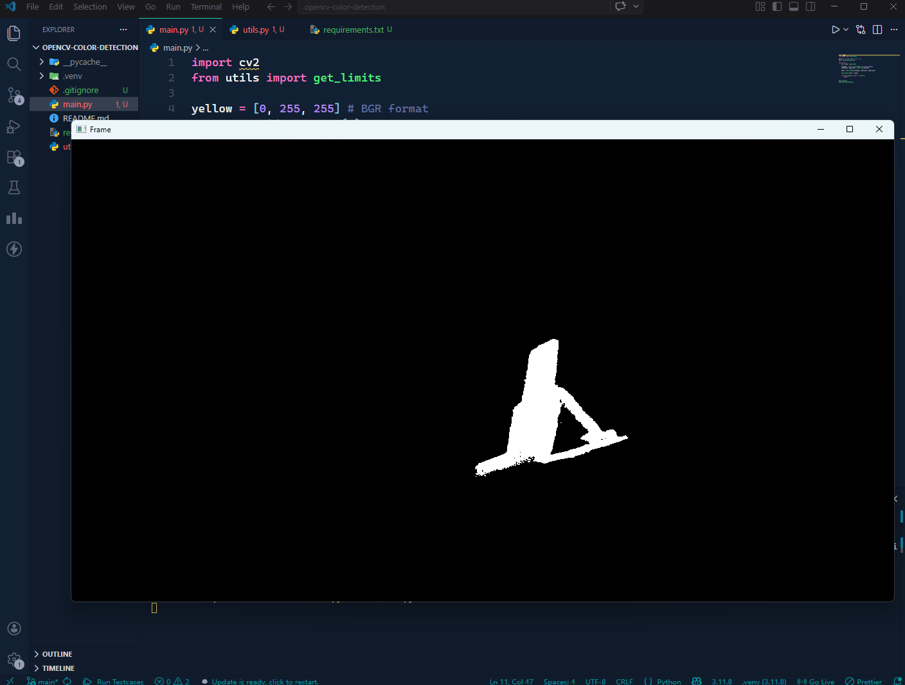
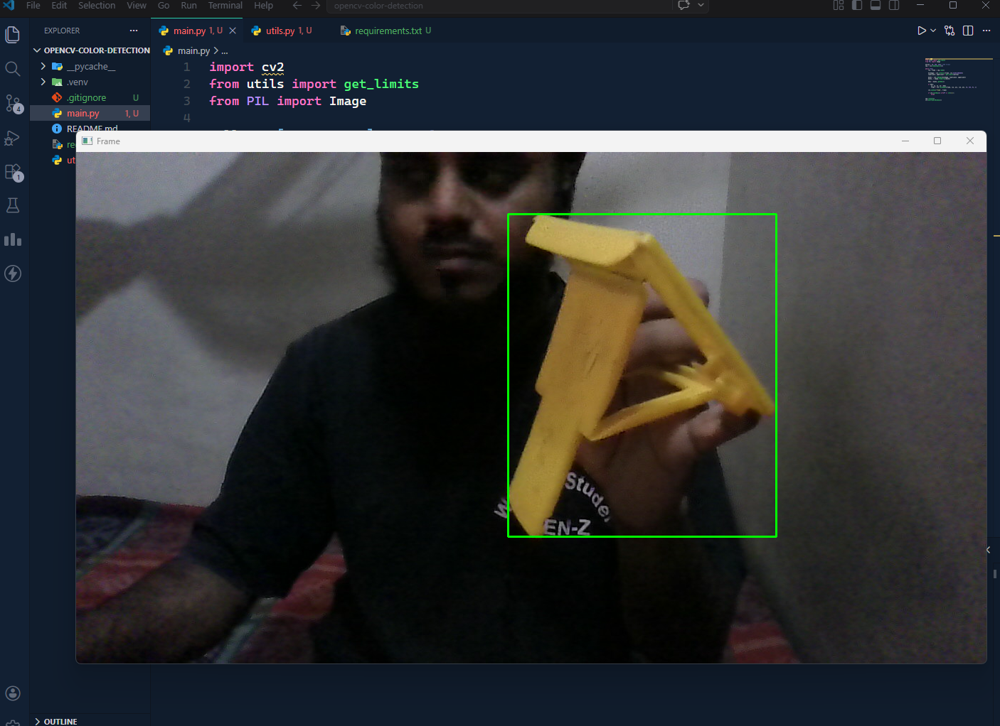

# OpenCV Color Detection

A Python + OpenCV project for real-time color detection and segmentation from a webcam feed.

## Features

- Real-time color detection using webcam input
- HSV-based segmentation for better lighting robustness
- Mask-based noise reduction
- Contour detection for object localization
- Support for multiple color ranges, including red (dual HSV range)

## How It Works

1. Capture a frame from the webcam
2. Convert BGR image to HSV
3. Define lower and upper HSV bounds
4. Create a mask with `cv2.inRange()`
5. Extract matching regions
6. Detect contours for object detection/tracking

## Why HSV Instead of RGB?

HSV separates hue from brightness, which makes color detection more stable under changing lighting conditions.

## Red Color Handling

Red lies at both ends of the HSV hue range, so detection uses two ranges:

- `0-10`
- `170-179`

## Tech Stack

- Python
- OpenCV (`cv2`)
- NumPy

## Run Locally

```bash
git clone https://github.com/<your-username>/opencv-color-detection.git
cd opencv-color-detection

python -m venv venv
venv\Scripts\activate   # Windows

pip install -r requirements.txt
python main.py
```

## Sample Output




## Future Improvements

- Add HSV trackbars for live tuning
- Detect multiple colors at once
- Add bounding-box based object tracking
- Improve robustness for real-world lighting
